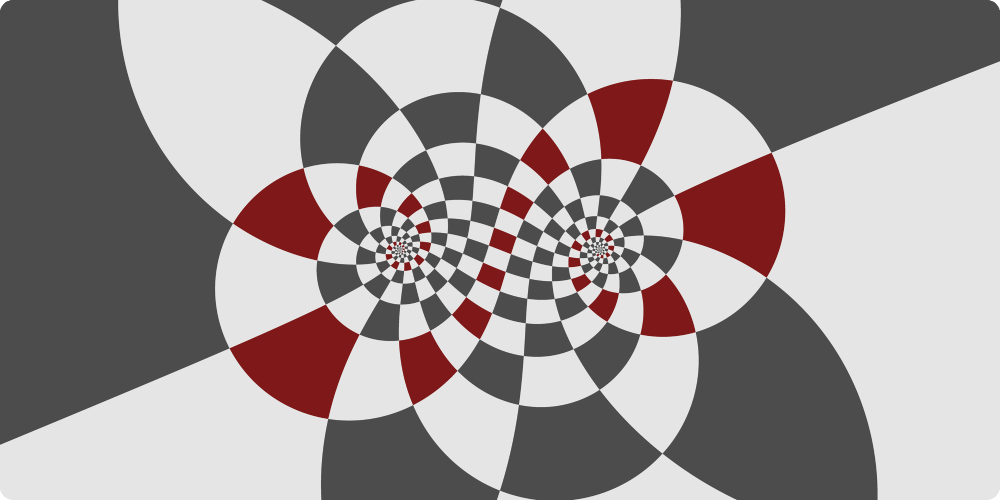

# Möbius shader

Simple GLSL ES 3.0 fragment shader for rendering Möbius transformations.

## Usage

You can directly paste the content of `main.glsl` to [The Book of Shaders Editor](https://thebookofshaders.com/edit.php).

Usage with other shader editors requires little tweaking (renaming uniforms, etc...)
